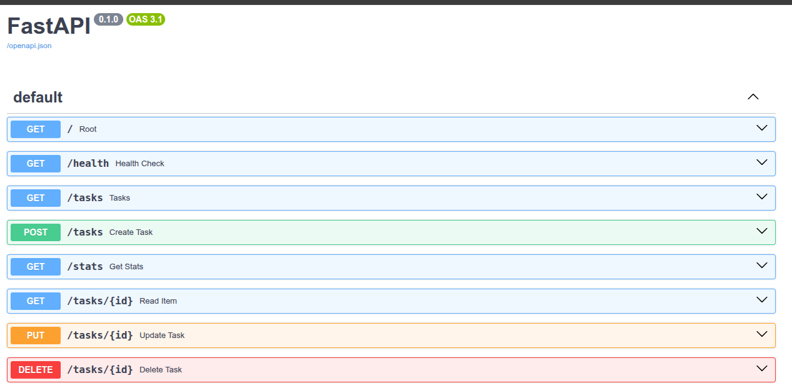
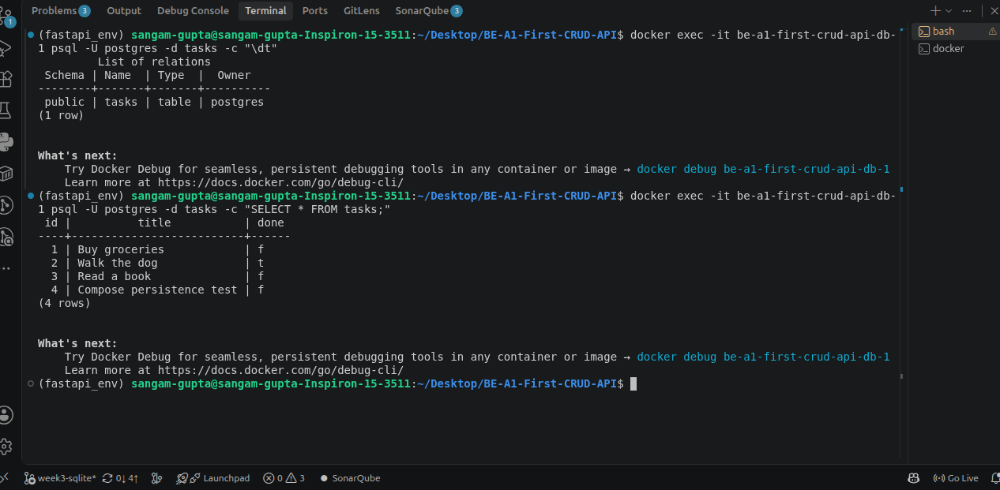

# Task API — FlyRank Internship (Assignments A1, A2 & A3)

A CRUD (Create, Read, Update, Delete) API for managing a to-do list, built with **FastAPI** (Python). The API now runs against a real **PostgreSQL** database inside a **Docker container**, and the entire stack — app + database — starts with a single command.

This project has gone through three storage upgrades as part of the FlyRank Backend AI Engineering internship track:
- **A1:** Build your first CRUD API — in-memory storage (a Python list).
- **A2:** Connecting your CRUD to the database — migrated to a SQLite file.
- **A3 (this stage):** Containerize your stack — migrated to PostgreSQL, running in Docker, orchestrated with Docker Compose.

---

## Tech Stack

- **Language:** Python 3.11
- **Framework:** FastAPI
- **Server:** Uvicorn
- **Database:** PostgreSQL 16, running in a Docker container
- **Database driver:** psycopg
- **Orchestration:** Docker Compose (one command starts the app and the database together)
- **Config:** `.env` file (git-ignored) for secrets, `python-dotenv` to load it

---

## How to Run — One Command

Clone the repository, then:

```
cp .env.example .env
docker compose up
```

That's it. Docker Compose will:
1. Build the app's image from the `Dockerfile`.
2. Pull and start a PostgreSQL 16 container.
3. Wait for the database to be genuinely ready (via a healthcheck) before starting the app.
4. Create the `tasks` table automatically if it doesn't exist.
5. Seed 3 example tasks — but only on the very first run.

The API will be available at `http://localhost:8000`.

To stop everything:
```
docker compose down
```

Your data survives this — a Docker **volume** keeps the database files on disk even after the containers are removed. Run `docker compose up` again and your tasks are still there.

---

## Environment Variables

This project reads its database connection from a single environment variable:

| Variable | Description | Example |
|---|---|---|
| `DATABASE_URL` | Full Postgres connection string | `postgres://postgres:dev@db:5432/tasks` |

Copy `.env.example` to `.env` and fill in your own values before running. `.env` is git-ignored and should **never** be committed — it's where your real database password lives.

---

## API Endpoints

| Method | Endpoint      | Description                                   | Success Status | Error Status                  |
| ------ | ------------- | --------------------------------------------- | -------------- | ------------------------------ |
| GET    | `/`           | Root endpoint — describes the API             | 200            | —                               |
| GET    | `/health`     | Health check — confirms the server is alive   | 200            | —                               |
| GET    | `/tasks`      | Returns tasks (supports `?search=` and `?done=` filters, sorted by title) | 200 | — |
| GET    | `/tasks/{id}` | Returns a single task by ID                   | 200            | 404 if not found                |
| POST   | `/tasks`      | Creates a new task (`title` required in body) | 201            | 400 if title is missing/empty  |
| PUT    | `/tasks/{id}` | Updates an existing task's `title` and `done` | 200            | 404 if not found                |
| DELETE | `/tasks/{id}` | Deletes a task by ID                          | 204            | 404 if not found                |
| GET    | `/stats`      | Returns task counts: total, done, open        | 200            | —                                |

All endpoint behaviour is unchanged from A1/A2 — only the storage engine underneath changed, from an in-memory list, to SQLite, to Postgres. Error responses return:

```
{ "detail": "Task 99 not found" }
```

---

## Example Request (curl)

**Creating a new task:**

```
curl -i -X POST http://localhost:8000/tasks -H "Content-Type: application/json" -d '{"title":"Buy milk"}'
```

**Response:**

```
HTTP/1.1 201 Created
content-type: application/json

{"id":4,"title":"Buy milk","done":false}
```

---

## Swagger UI

Interactive API documentation is available at:

```
http://localhost:8000/docs
```

**Screenshot:**

---

## The Database

Postgres runs as its own container (service name `db` in `compose.yaml`), with one table:

```sql
CREATE TABLE IF NOT EXISTS tasks (
    id    SERIAL PRIMARY KEY,
    title TEXT,
    done  BOOLEAN
)
```

To look inside the database directly:

```
docker exec -it be-a1-first-crud-api-db-1 psql -U postgres -d tasks -c "\dt"
docker exec -it be-a1-first-crud-api-db-1 psql -U postgres -d tasks -c "SELECT * FROM tasks;"
```

**Screenshot:**


---

## Why Postgres (and Why Docker)?

SQLite (A2) is a single file — simple, but only one process can write to it comfortably, and it doesn't reflect how most real backends run in production. PostgreSQL is a full database *server* — the same kind of engine that powers large-scale, multi-user applications, FlyRank included.

Rather than installing Postgres directly onto the machine (version conflicts, "works on my machine" problems), it runs in a **Docker container**: a frozen, ready-made copy of Postgres that behaves identically on any machine. Docker Compose then lets both the app and the database start together, in the right order, with one command — no manual setup steps for anyone who clones this repo.

---

## Persistence — Proving Data Survives a Full Stack Restart

Unlike a plain container restart, this proves the *whole stack* can go down and come back with data intact:

1. Create a task via `POST /tasks`.
2. `docker compose down` — stops and removes both containers.
3. `docker compose up` — rebuilds and starts both containers fresh.
4. `GET /tasks` — the task is still there.

This works because of the **volume** (`taskdata`) attached to the `db` service — it lives outside the container's lifecycle, so removing and recreating the container doesn't touch the actual data files.

---

## A Real Debugging Story: The `depends_on` Gotcha

Early on, `docker compose up` produced a `psycopg.OperationalError: connection failed... Connection refused`. The `api` container was starting *before* Postgres had finished initializing — `depends_on` alone only waits for a container to *start*, not for the database inside it to actually be ready to accept connections.

The fix was adding a `healthcheck` to the `db` service (using `pg_isready`) and changing `api`'s `depends_on` to wait for `condition: service_healthy` instead of just the container starting. This is a common real-world Docker Compose issue — container "running" and service "ready" are two different things.

---

## From A1 → A2 → A3 — What Changed

| Layer     | A1 (Week 2)         | A2 (Week 3)              | A3 (this stage)                  |
| --------- | -------------------- | -------------------------- | ---------------------------------- |
| Storage   | Python list, in memory | SQLite file (`tasks.db`)  | PostgreSQL, in a Docker container |
| Runs as   | part of the app itself | a file on disk             | its own server, in a container    |
| IDs       | manually tracked counter | auto-assigned by SQLite   | auto-assigned by Postgres (`SERIAL`) |
| Query placeholders | — | `?` | `%s` |
| Secrets   | none                  | none                        | `.env` file, git-ignored           |
| Startup   | `uvicorn main:app`   | `uvicorn main:app`         | `docker compose up`                |
| Data on restart | gone            | still there                 | still there (via a volume)         |
| Endpoints | GET/POST/PUT/DELETE `/tasks` | unchanged | unchanged |

The client never notices any of this — the API's behaviour is identical across all three. Only where and how the data is stored has changed, which is the entire point of these three assignments.

---

## Project Structure

```
BE-A1-First-CRUD-API/
├── main.py             # FastAPI app — all CRUD endpoints, now backed by Postgres
├── Dockerfile           # Builds the app's own image
├── compose.yaml         # Defines the api + db services and how they connect
├── requirements.txt
├── .env.example          # Template for required environment variables
├── .env                  # Real secrets (git-ignored, never committed)
├── README.md
└── index.html            # Frontend that consumes the API
```