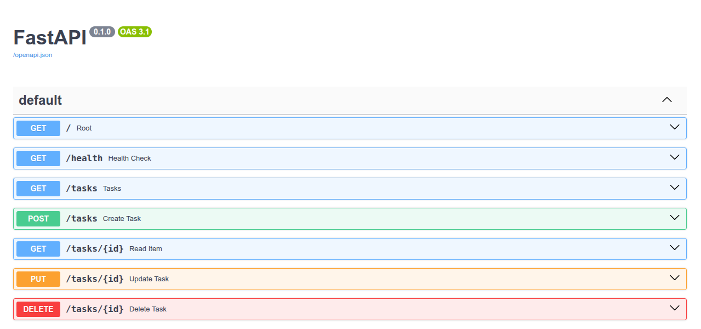
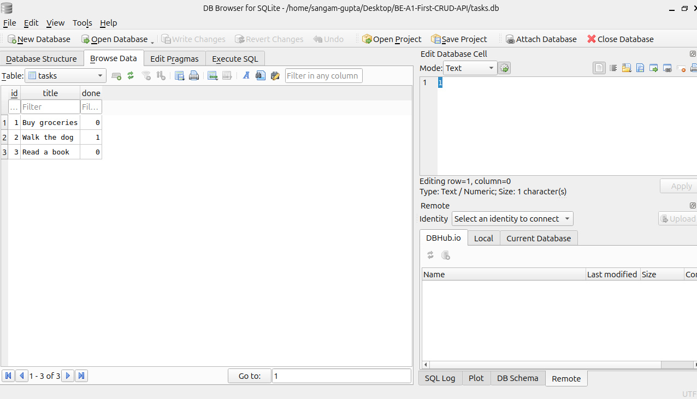

# Task API — FlyRank Internship, Week 2 & 3 (Assignments A1 & A2)

A CRUD (Create, Read, Update, Delete) API for managing a to-do list, built with **FastAPI** (Python). The API stores tasks in a **SQLite database** (`tasks.db`), so data now survives a server restart, and exposes interactive documentation via **Swagger UI**.

This project was built as part of the FlyRank Backend AI Engineering internship track:
- **Week 2 (A1):** Build your first CRUD API — in-memory storage.
- **Week 3 (A2):** Connecting your CRUD to the database — migrated storage from an in-memory list to SQLite.

---

## Tech Stack

- **Language:** Python 3.10+
- **Framework:** FastAPI
- **Server:** Uvicorn
- **Data storage:** SQLite (`tasks.db`) — a single-file, serverless database
- **Frontend:** Plain HTML, CSS, and JavaScript (`fetch` API), connected live to the backend

---

## Why SQLite?

SQLite was chosen for this stage because it needs **zero setup** — no server to install or run, just a single file on disk. It's built directly into Python's standard library (`import sqlite3`, nothing to install), and it's the natural next step up from in-memory storage: simple enough for a small project like this, but it gives real persistence — data written to `tasks.db` is still there the next time the server starts.

---

## How to Install & Run

Clone the repository and run the following commands from the project folder:

```
pip install fastapi uvicorn
uvicorn main:app --reload
```

The server will start at `http://localhost:8000`.

On first run, a `tasks.db` file is created automatically in the project folder, the `tasks` table is created if it doesn't already exist, and three example tasks are seeded — but only if the table is empty. Restarting the server does **not** duplicate the seed data.

To use the frontend, open `index.html` directly in your browser (double-click the file, or use a Live Server extension) while the backend is running.

---

## API Endpoints

| Method | Endpoint      | Description                                   | Success Status | Error Status                  |
| ------ | ------------- | --------------------------------------------- | -------------- | ----------------------------- |
| GET    | `/`           | Root endpoint — describes the API             | 200            | —                              |
| GET    | `/health`     | Health check — confirms the server is alive   | 200            | —                              |
| GET    | `/tasks`      | Returns the full list of tasks                | 200            | —                              |
| GET    | `/tasks/{id}` | Returns a single task by ID                   | 200            | 404 if not found              |
| POST   | `/tasks`      | Creates a new task (`title` required in body) | 201            | 400 if title is missing/empty |
| PUT    | `/tasks/{id}` | Updates an existing task's `title` and `done` | 200            | 404 if not found              |
| DELETE | `/tasks/{id}` | Deletes a task by ID                          | 204            | 404 if not found              |

The endpoints and their behaviour are unchanged from Week 2 — only the storage layer underneath changed, from a Python list to SQLite. All error responses return a JSON body in the form:

```
{ "error": "Task 99 not found" }
```

---

## Example Request (curl)

**Creating a new task:**

```
curl -i -X POST http://localhost:8000/tasks -H "Content-Type: application/json" -d '{"title":"Buy milk"}'
```

**Response:**

```
HTTP/1.1 201 Created
content-type: application/json

{"id":6,"title":"Buy milk","done":false}
```

---

## Swagger UI

Interactive API documentation is available at:

```
http://localhost:8000/docs
```

FastAPI generates this automatically from the code — no extra setup required. Every endpoint listed above can be tested directly from this page using the **"Try it out"** button.

**Screenshot:** 

---

## The Database

Data is stored in a SQLite file, `tasks.db`, with a single table:

```sql
CREATE TABLE IF NOT EXISTS tasks (
    id    INTEGER PRIMARY KEY,
    title TEXT,
    done  INTEGER
)
```

`tasks.db` is created automatically the first time the app runs and is **git-ignored**, so every fresh clone starts with a clean database, seeded with 3 example tasks.

### Exploring the database by hand

Using [DB Browser for SQLite](https://sqlitebrowser.org/), I opened `tasks.db` directly and ran some queries in the "Execute SQL" tab:

```sql
SELECT * FROM tasks WHERE done = 1;
```

This returned only the tasks marked as completed — confirming the `done` column stores `0`/`1` correctly and that filtering works exactly as it would through the API's `WHERE` clauses.

**Observation:** Changing data through DB Browser and then calling `GET /tasks` from the API — with no server restart — reflected the change instantly. There's no "syncing" step; the API and DB Browser both read the exact same file, so there's really just one source of truth.

**Screenshot:** 

---

## Persistence — Proving Data Survives a Restart

Unlike Week 2 (in-memory), tasks created now survive a server restart:

1. Create a task via `POST /tasks`.
2. Stop the server (`Ctrl+C`).
3. Start it again (`uvicorn main:app --reload`).
4. `GET /tasks` — the task is still there.

This is the core difference this assignment introduces: the API's promise (create, read, update, delete tasks) stays the same; only where that promise is *kept* changed, from RAM to disk.

---

## Frontend

A minimal frontend (`index.html`) is included to demonstrate the full CRUD cycle visually:

- View all tasks
- Add a new task
- Mark a task as done/undone (via checkbox — triggers a `PUT` request)
- Delete a task

The frontend also displays the **live request and response** for every action (method, path, request body, status code, and response JSON), so the full request/response cycle is visible in real time.

To use it: start the backend server first, then open `index.html` in a browser.

---

## Project Structure

```
BE-A1-First-CRUD-API/
├── main.py           # FastAPI backend — all CRUD endpoints, now backed by SQLite
├── tasks.db           # SQLite database file (auto-created, git-ignored)
├── index.html          # Frontend that consumes the API
├── README.md
└── swagger-screenshot.png
```

---

## From Week 2 to Week 3 — What Changed

| Layer     | Week 2 (A1)             | Week 3 (A2)                     |
| --------- | ------------------------ | -------------------------------- |
| Storage   | Python list, in memory   | SQLite database (`tasks.db`)     |
| IDs       | Manually tracked counter | Auto-assigned by the database    |
| Data on restart | Gone                | Still there                      |
| Queries   | Loop over a list         | Parameterized SQL (`?` placeholders) |
| Endpoints | GET/POST/PUT/DELETE `/tasks` | Unchanged — same routes, same responses |

The client can't tell the difference — that separation between the API and its storage is the whole point of this assignment.