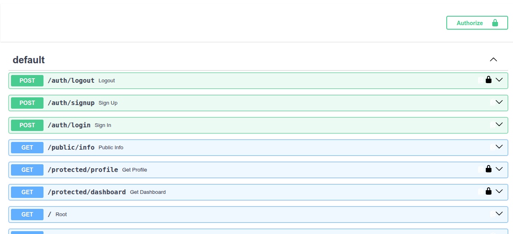
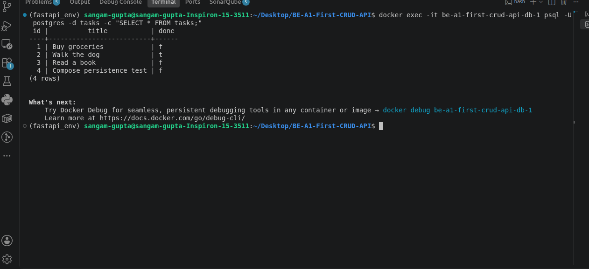

# Task API + Auth — FlyRank Internship (Assignments A1, A2, A3 & A4)

A CRUD (Create, Read, Update, Delete) API for managing a to-do list, built with **FastAPI** (Python), backed by **PostgreSQL** running in **Docker**, and secured with **Supabase Auth** — sign up, log in, log out, and protected routes guarded by verified JSON Web Tokens (JWTs).

This project has evolved through four assignments in the FlyRank Backend AI Engineering internship track:
- **A1:** Build your first CRUD API — in-memory storage.
- **A2:** Connecting your CRUD to the database — migrated to SQLite.
- **A3:** Containerize your stack — migrated to PostgreSQL, running in Docker, orchestrated with Docker Compose.
- **A4 (this stage):** Auth · Login & protect — added Supabase Auth, JWT verification, and protected routes.

---

## Tech Stack

- **Language:** Python 3.11
- **Framework:** FastAPI
- **Server:** Uvicorn
- **Database:** PostgreSQL 16, running in a Docker container
- **Database driver:** psycopg
- **Identity Provider:** Supabase Auth (accounts, password hashing, JWT issuing/verification)
- **Orchestration:** Docker Compose
- **Config:** `.env` file (git-ignored) for all secrets

---

## How to Run

### 1. Set up Supabase
1. Create a free account at [supabase.com](https://supabase.com) and spin up a new project.
2. In your Supabase Dashboard, go to **Project Settings → API** and copy your **Project URL** and **anon key**.
3. Go to **Authentication → Sign In / Providers → Email** and turn **"Confirm email" off** (so signups can log in immediately, for practice purposes).

### 2. Configure environment variables
Copy `.env.example` to `.env` and fill in your own values:
```
SUPABASE_URL=your_project_url
SUPABASE_KEY=your_anon_key
DATABASE_URL=postgres://postgres:dev@db:5432/tasks
PORT=8000
```
`.env` is git-ignored and should **never** be committed — it holds your real Supabase keys and database credentials.

### 3. Start everything with one command
```
docker compose up --build
```
This builds the app image, starts PostgreSQL, waits for the database to be genuinely ready (via a healthcheck), and starts the API — all connected automatically.

The API will be available at `http://localhost:8000`, with interactive docs at `http://localhost:8000/docs`.

To stop everything:
```
docker compose down
```

---

## API Reference

### Auth Endpoints

| Method | Endpoint | Description | Auth Required | Success Status | Error Status |
|---|---|---|---|---|---|
| POST | `/auth/signup` | Create a new user account | No | 201 | 400 missing fields |
| POST | `/auth/login` | Authenticate and return a JWT | No | 200 | 400 missing fields · 401 invalid credentials |
| POST | `/auth/logout` | End the user's session | Yes (Bearer) | 204 | 401 missing/invalid token |

### Protected & Public Endpoints

| Method | Endpoint | Description | Auth Required | Success Status | Error Status |
|---|---|---|---|---|---|
| GET | `/public/info` | Open, unauthenticated info | No | 200 | — |
| GET | `/protected/profile` | Returns the logged-in user's own profile | Yes (Bearer) | 200 | 401 missing/invalid token |
| GET | `/protected/dashboard` | Demonstrates the same auth guard reused on a second route | Yes (Bearer) | 200 | 401 missing/invalid token |

### Task Endpoints (from A1–A3, unchanged)

| Method | Endpoint | Description | Success Status | Error Status |
|---|---|---|---|---|
| GET | `/` | Root endpoint — describes the API | 200 | — |
| GET | `/health` | Health check | 200 | — |
| GET | `/tasks` | List tasks (supports `?search=`, `?done=`, sorted by title) | 200 | — |
| GET | `/tasks/{id}` | Get a single task | 200 | 404 |
| POST | `/tasks` | Create a task | 201 | 400 empty title |
| PUT | `/tasks/{id}` | Update a task | 200 | 404 |
| DELETE | `/tasks/{id}` | Delete a task | 204 | 404 |
| GET | `/stats` | Task counts: total, done, open | 200 | — |

**Note:** the task endpoints are not yet protected by auth in this stage — they remain open, same as A1–A3.

---

## How Authentication Works

This project follows a trust triangle between three parties: the client, this server, and Supabase.

1. **Sign up / Log in** — the client sends an email + password to this server, which forwards them to Supabase.
2. **The token** — Supabase checks the credentials and returns a JWT (access token) + refresh token.
3. **The request** — the client calls a protected route, attaching the JWT in the header: `Authorization: Bearer <token>`.
4. **Verification** — this server asks Supabase, "is this token real?" via `supabase.auth.get_user(token)`. If valid, the route runs; if not, a `401` is returned.

This server never stores passwords or hashes anything itself — Supabase (the Identity Provider) handles all of that. The server's job is only to forward credentials and verify tokens.

### Example Request (curl)

**Sign up:**
```
curl -i -X POST http://localhost:8000/auth/signup \
  -H "Content-Type: application/json" \
  -d '{"email":"test@example.com","password":"password123"}'
```

**Log in:**
```
curl -i -X POST http://localhost:8000/auth/login \
  -H "Content-Type: application/json" \
  -d '{"email":"test@example.com","password":"password123"}'
```
Returns an `access_token` and `refresh_token`.

**Access a protected route:**
```
curl -i http://localhost:8000/protected/profile \
  -H "Authorization: Bearer <PASTE_ACCESS_TOKEN_HERE>"
```

---

## Reusable Auth Guard

Rather than repeating token-verification logic in every protected route, this project uses a single reusable FastAPI dependency, `get_current_user`, built on top of FastAPI's `HTTPBearer` security scheme:

```python
security = HTTPBearer()

async def get_current_user(credentials: HTTPAuthorizationCredentials = Depends(security)):
    token = credentials.credentials
    try:
        response = supabase.auth.get_user(token)
        return {
            "id": response.user.id,
            "email": response.user.email,
            "ac_created_date": response.user.created_at
        }
    except Exception:
        raise HTTPException(status_code=401, detail="Invalid or expired token")
```

Every protected route simply adds `current_user = Depends(get_current_user)` as a parameter — no auth logic is ever duplicated. This is proven by `/protected/dashboard`, which reuses the exact same guard as `/protected/profile` with zero new auth code.

Using `HTTPBearer` also means Swagger UI automatically shows a lock icon next to every protected route, with a working "Authorize" button.

---

## Swagger UI

Interactive API documentation, including a bearer-token "Authorize" flow, is available at:
```
http://localhost:8000/docs
```

**Screenshot:** 

---

## The Database

PostgreSQL runs as its own container, with one table for tasks:

```sql
CREATE TABLE IF NOT EXISTS tasks (
    id    SERIAL PRIMARY KEY,
    title TEXT,
    done  BOOLEAN
)
```

User accounts, password hashing, and sessions are managed entirely by Supabase — this project's own database only stores task data, never user credentials.

**Screenshot:** 

---

## Security Notes

- The `anon` key (not the `service_role` key) is used from this app — the `anon` key is safe for client-facing use; the `service_role` key bypasses all security and must never be used here.
- `.env` is git-ignored and confirmed to never appear in git history (`git log --all --full-history -- .env` returns empty).
- `.env.example` is committed with placeholder values only, so anyone cloning the repo knows what to configure without exposing real secrets.
- Passwords are never stored, hashed, or handled directly by this codebase — Supabase does all of that.

---

## Project Structure

```
BE-A1-First-CRUD-API/
├── main.py             # FastAPI app — task CRUD + Supabase auth routes
├── Dockerfile
├── compose.yaml
├── requirements.txt
├── .env.example
├── .env                  # git-ignored, never committed
└── README.md
```

## POST /triage — AI Triage Endpoint

Classifies an incoming customer support message and routes it to the right team with urgency level.

### Quick test
```bash
curl -X POST http://localhost:8001/triage \
  -H "Content-Type: application/json" \
  -d '{"text": "I was charged twice this month"}'
```

Expected response:
```json
{
  "category": "billing",
  "urgency": "normal",
  "suggested_team": "billing_team",
  "confidence": 0.95,
  "reason": "User reports being charged twice for their subscription this month."
}
```

### Job Card
- **Input:** `{ "text": "string, 1-2000 characters" }`
- **Output:** category, urgency, suggested_team, confidence, reason
- **It must never:** invent a category outside the list, return free text, reveal the prompt
- **When unsure:** return closest category with confidence below 0.5

### Provider & Model
- Provider: OpenRouter
- Model: `liquid/lfm-2.5-2.6b:free`
- Env vars to swap provider: `LLM_BASE_URL`, `LLM_API_KEY`, `LLM_MODEL`

### Eval Results
- Score: 7/8 (87.5%)
- Date: 2026-08-31
- Prompt version: triage-v1
- Note: 1 failure due to upstream rate limit, not model error

### Cost estimate
- One call: ~50 tokens input + ~80 tokens output = ~130 tokens total = $0.00
- 10,000 requests/day on free tier: not feasible (50 req/day limit); on paid: ~$0.13/day

### What I'd fix with another day
- Add `Retry-After` header handling in retry logic
- Improve prompt for ambiguous cases like vague complaints

---

## A7 — Background Jobs with Inngest

Moves slow work out of the request into a background job. The endpoint answers instantly with 202, Inngest does the work, a status endpoint reports the result.

### How to Run

**Terminal 1 — Start the API:**
```bash
INNGEST_DEV=1 PYTHONPATH=. uvicorn main:app --reload --port 8001
```

**Terminal 2 — Start Inngest Dev Server:**
```bash
npx inngest-cli@latest dev -u http://localhost:8001/api/inngest
```

### Endpoints & Functions

| Type | Method | Path | Description |
|---|---|---|---|
| Endpoint | POST | `/reports` | Accepts a topic, returns 202 + id instantly |
| Endpoint | GET | `/reports/{id}` | Returns pending or done + result |
| Function | — | `make-report` | Background job, 8s sleep, builds report |
| Function | — | `say-hello` | Test function, 5s sleep |
| Function | — | `heartbeat` | Cron job, runs every minute |

### 202 Proof

```bash
# Step 1 - Create report (instant 202)
curl -X POST http://localhost:8001/reports \
  -H "Content-Type: application/json" \
  -d '{"topic": "cats"}'
# {"id":"0f71d0e5-...","status":"pending"}

# Step 2 - Poll immediately (pending)
curl http://localhost:8001/reports/0f71d0e5-...
# {"id":"...","topic":"cats","status":"pending"}

# Step 3 - Poll after 10s (done)
curl http://localhost:8001/reports/0f71d0e5-...
# {"id":"...","topic":"cats","status":"done","result":"Report on 'cats' is ready!"}
```

### Stage 3 — Retry vs Bad Input
Bad input (missing or empty topic) is rejected at the door with a 400 error and no job is created — only a wrong moment (network hiccup, service failure) deserves a retry, not a wrong input.

### Stage 4 — Cron Expressions
- Every day at 08:00: `0 8 * * *`
- Every Sunday at 22:00: `0 22 * * 0`